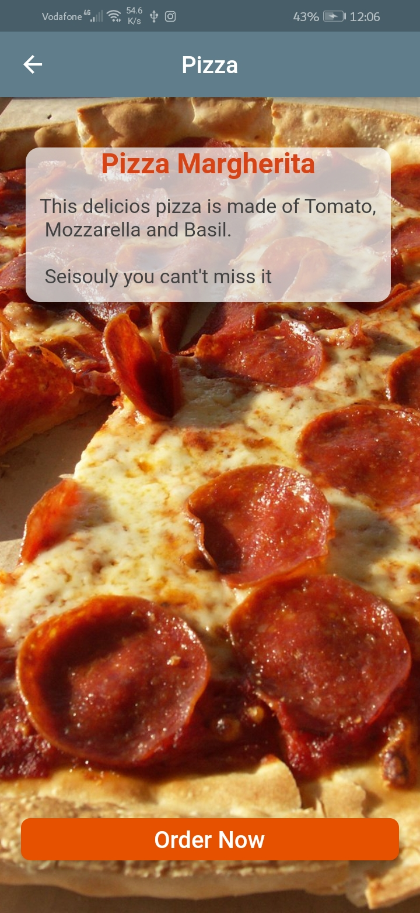
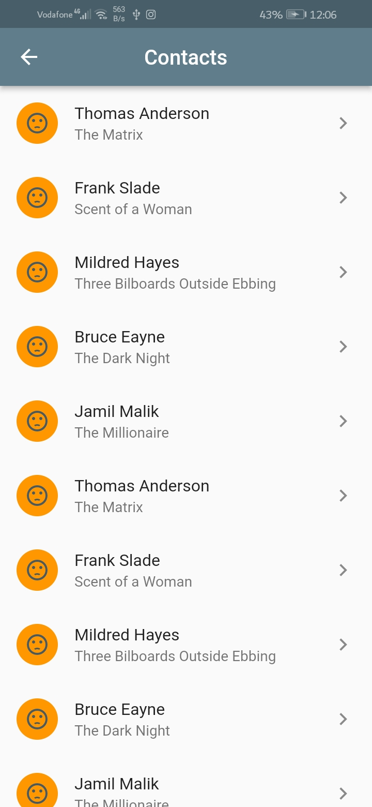
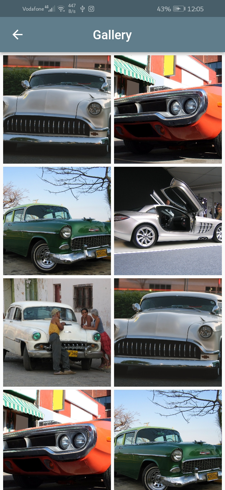

# Pizza Margherita

A new Flutter project. To know the features of Stack, ListView and GridView.

# Covered:
## Stack

## Scrolling Widgets
### ListView
  * ListView.Builder
  * ListView.Seperated
### GridView
  * GridView.Count

* Layout with Overlapping Widgets
* ListTile
* Card

# Definitions
## ListTile:
  A single fixed-height row that contains some text and a leading or trailing icon.

  
### Main purposes of this project:
* How to use the Stack, ListView and GridView

#### Project Pages:
- Pizza 1 'Local'
- Pizza 1 'Network'
- Contacts 
- Gallery 

## ScreenShots

  
  
  
   

